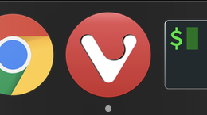

# vivaldi-icon
Because I love [Vivaldi browser](https://vivaldi.com/), but not necessarily its icon, I made a nicer, round version of it.

## Manual installation (MacOS)
1. Download **vivaldi-icon.icns**
2. Open **Applications**
3. Find **Vivaldi.app**
4. Open Inspector (<kbd>cmd+i</kbd>)
5. Drag **vivaldi-icon.icns** file onto the little icon in the top left of the inspector.
6. Quit **Vivaldi** and open it again.
7. Done!

### Preview
It should look that nice: 

